<!-- .slide: class="slide__title" data-background-video="media/video/aframe-logo.mp4" data-background-video-loop="true" data-state="state--bg-blue" -->

<div class="talk-title">
  <h1>A-Frame</h1>
  <h2>Building VR on the Web</h2>
  <p class="talk-info">
    @you | mozvr.com | aframe.io
  </p>
</div>

<!-- NOTES -->
- Introduce yourself
- Goal: bring high-performance VR to the Web, creating an open/connected VR platform
- WebVR, why we need VR on the Web, and how to build WebVR experiences

------

# Virtual Reality

<!-- .slide: data-background-video="media/video/virtualreality.mp4" data-background-video-loop="true" data-state="state--bg-dark" -->

<!-- NOTES -->
- Ask how many have tried VR.
- Virtual reality is a technology platform that transports you to realistic, interactive, immersive 3D environments
- It's the next platform, will change how we work + play + communicate digitally, face of society

---

# Fun!

<!-- .slide: data-background="media/img/vrshooting.jpg" data-state="state--bg-dark" -->

<!-- NOTES -->
- Tell interested stories about your experiences with VR.

---

<div class="image-row">
  <div>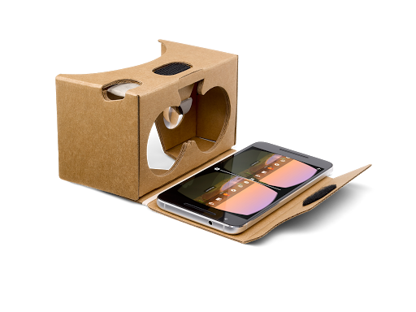</div>
  <div>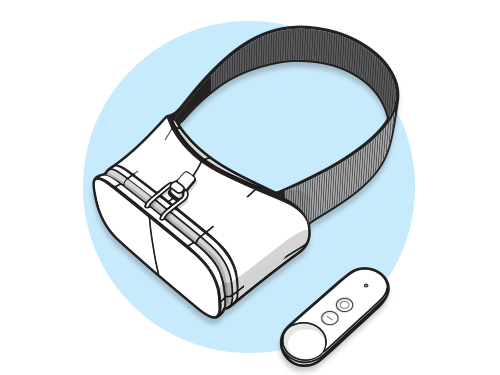</div>
  <div>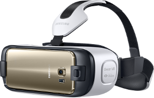</div>
</div>

<div class="image-row">
  <div>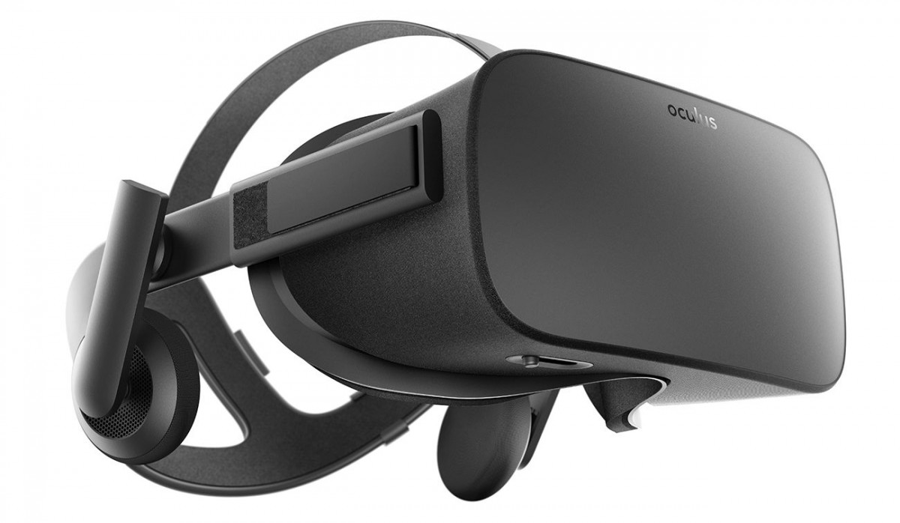</div>
  <div>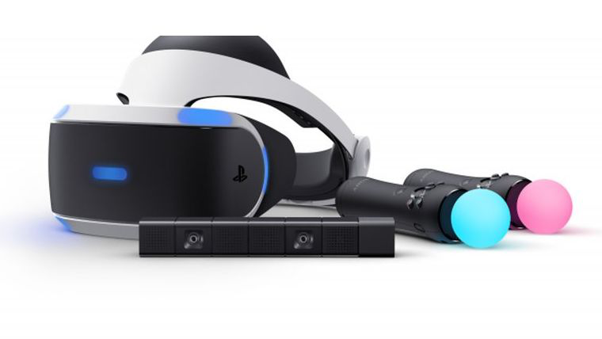</div>
  <div>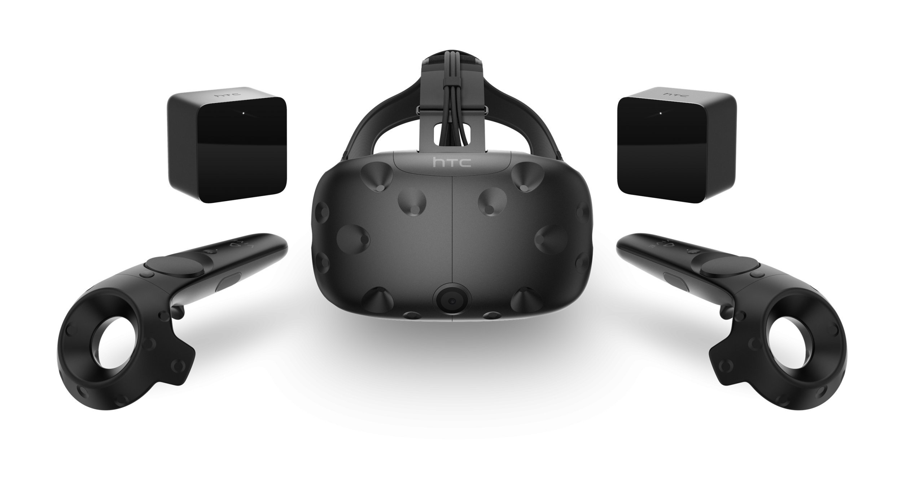</div>
</div>

<!-- NOTES -->
- Backed by the largest corporations in the world, everyone wants in
- Range from cheap to expensive, tethered and untethered, controllers, tracking
- HTC Vive with Steam currently offers the most compelling experiences, but never know
- See a lot of different devices, systems, platforms competing against each other...

---

## Friction of VR Ecosystems

<div class="captioned-image-row">
  <div>
    
    <i>Gatekeepers</i>
  </div>
  <div>
    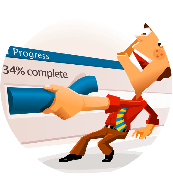
    <i>Installs</i>
  </div>
  <div>
    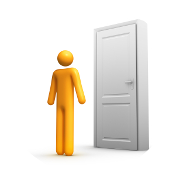
    <i>Closed</i>
  </div>
</div>

<!-- NOTES -->
- App stores and corporations control distribution: can take down or block content
- Downloads / installs are a barrier to consumption: small business pages
- Closed ecosystem: proprietary engines, steep learning curves, siloed experiences, fragmentation
- We want VR to be successful, so we want a platform without these points of friction. The answer is WebVR...

------

# WebVR

An open virtual reality platform with the advantages of **the Web**

<div class="captioned-image-row">
  <div>
    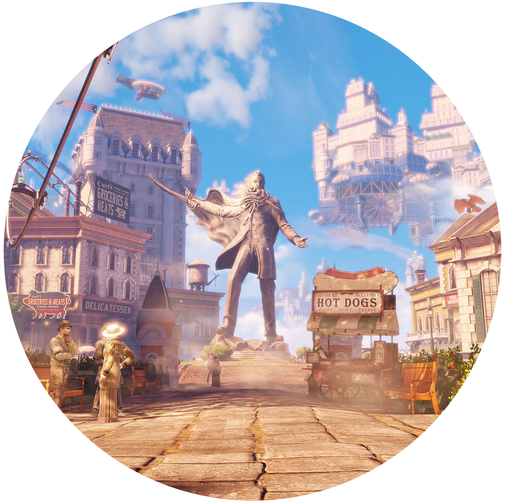
    <i>Open</i>
  </div>
  <div>
    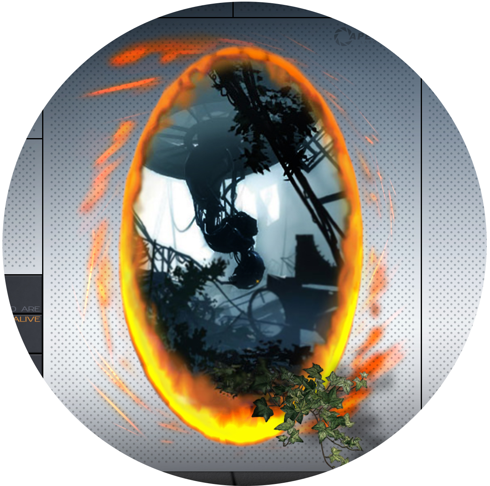
    <i>Connected</i>
  </div>
  <div>
    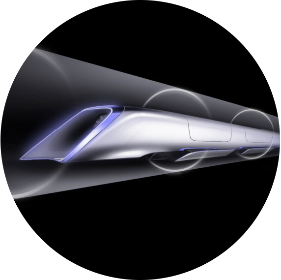
    <i>Instant</i>
  </div>
</div>

<!-- NOTES -->
WebVR is...virtual reality in the browser, powered by the Internet

Open:
- Anyone can publish
- Open source culture with open standards

Connected:
- Traverse worlds

Instant:
- Click a link on Twitter or Weibo, immediate VR experiences
- No installs
- Imagine for long tail experiences: shopping & personal spaces
- Great for long tail bite-sized experiences

Transition:
- Web has advantages that make it the best platform for the people
- Need to act to make it reality, can't wait for VR to bake and crystallize
- Get involved

---

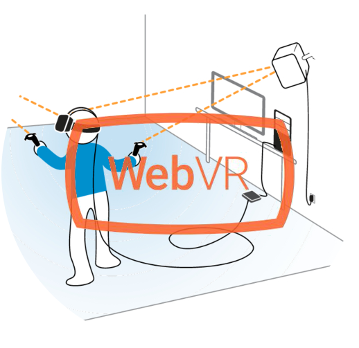

Browser APIs that enable WebGL rendering to headsets and access to VR
sensors

https://w3c.github.io/webvr/

<!-- NOTES -->
API:
- Optimized rendering path to headsets
- Access position and rotation (pose) data

History:
- Initial WebVR API by Mozilla
- Working W3C community group
- Mozilla, Google, Samsung, Microsoft, community currently iterating WebVR 1.0 API

Not just a specification, it's implemented...

---

<div class="captioned-image-row">
  <div>
    
    <i>Firefox Nightly</i>
  </div>
  <div>
    
    <i>Chromium (Experimental)</i>
  </div>
  <div>
    
    <i>Samsung Internet</i>
  </div>
  <div>
    
    <i>Mobile Polyfill</i>
  </div>
</div>

<!-- NOTES -->
- Firefox + Chrome WebVR 1.0 hits release channels by early 2017
- Currently behind Nightly, custom builds, and flags
- Mobile Polyfill: use device motion / orientation sensors to polyfill on smartphones
- With all the browsers behind it...

---

<!-- .slide: data-background-video="media/video/roomscale.mp4" data-state="state--bg-dark" -->

## The Web is Ready for VR

<!-- NOTES -->
- Today, walk in web page and reach out with your hands
- Fast
- WebVR page where we can walk around and paint in 3D space
- Web developers getting involved to experiment, prototype, create, we are
  pitching into foundations of Metaverse...

---

## Metaverse

<!-- .slide: data-background="media/img/metaverse.png" -->

<!-- NOTES -->
- Shared persistent collective virtual spaces
- Alternate digital reality that the world may live, work, play
- Must be decentralized/open/connected, the Web is best platform to fully realize
- Where do we begin?
- three.js abstracts WebGL, 3D, and WebVR, but could still make it more accessible

---

Too hard to create WebVR experiences...

---

<!-- .slide: data-background-video="media/video/boilerplate.mp4" data-state="state--bg-dark" -->

<div class="slide__boilerplate">
  <p>Import WebVR polyfill</p>
  <p>Set up camera</p>
  <p>Set up lights</p>
  <p>Initialize scene</p>
  <p>Declare and pass canvas</p>
  <p>Listen to window resize</p>
  <p>Install VREffect</p>
  <p>Instantiate renderer</p>
  <p>Create render loop</p>
  <p>Preload assets</p>
  <p>Figure out responsiveness</p>
  <p>Deal with metatags and mobile</p>
</div>

<!-- NOTES -->
- It's still too difficult to create WebVR experiences
- Huge obstacle if doing small prototypes and experiments
- Boilerplate needs updating with new versions of WebVR, three.js, and browser quirks
- Encapsulate all of that into one line...

---

<!-- .slide: data-transition="concave" -->

```html
<a-scene></a-scene>
```

<!-- NOTES -->
- And...

---

```js
// Box in three.js
var geometry = new THREE.BoxGeometry(1, 2, 3);
var material = new THREE.MeshStandardMaterial({color: 'red'});
var box = new THREE.Mesh(geometry, material);
box.position.set(10, 0, 10);
scene.add(box);
```

<!-- NOTES -->
- Creating the simplest object in vanilla three.js
- Takes five lines, three classes, three variables for a box
- We could make that simple too...

---

<!-- .slide: data-transition="concave" -->

```html
<a-scene>
  <a-box color="red" position="10 0 10"></a-box>
</a-scene>
```

<!-- NOTES -->
- Makes WebVR a lot easier, easier means more content, more content advances platform
- So the Mozilla VR team created...

------

# A-Frame

<!-- .slide: data-background="media/img/aframe-rendered-full.png" -->

A declarative framework for building virtual reality experiences on the Web

<!-- NOTES -->
- Launched last December
- Why:
  - Easy for web developers to create VR content, without graphics knowledge
  - Prototype and experiment WebVR and VR UX faster
  - Vehicle to kickstart WebVR ecosystem

---

## Hello World

<!-- .slide: data-transition="slide-in none" -->

```html
<a-scene>
  <a-box color="#4CC3D9" position="-1 0.5 -3" rotation="0 45 0"></a-box>
  <a-cylinder color="#FFC65D" position="1 0.75 -3" radius="0.5" height="1.5"></a-cylinder>
  <a-sphere color="#EF2D5E" position="0 1.25 -5" radius="1.25"></a-sphere>
  <a-plane color="#7BC8A4" position="0 0 -4" rotation="-90 0 0" width="4" height="4"></a-plane>
  <a-sky color="#ECECEC"></a-sky>
</a-scene>
```
<!-- .element: class="stretch" -->

<!-- NOTES -->
- Simple HTML markup for a basic scene
- Remember to manipulate on second display
- Readable: HTML arguably most accessible language in computing
- Declarative: visual representation of scene graph, fully represents state
- Encapsulated: copy-and-paste HTML anywhere else and still work, no variables
- And here's what we get...

---

## Hello World

<!-- .slide: data-transition="none" -->

<div class="stretch" data-aframe-scene="scenes/hello-world.html"></div>

<!-- NOTES -->
- As web technology, we can embed within slides
- Can view this in desktop, Android, iOS, Samsung Gear VR, Oculus Rift, HTC Vive
- View source in DOM inspector and change values live
- Based on DOM, compatible with all libraries/frameworks: d3.js, Vue.js, React

---

## MagicaVoxel

<!-- .slide: data-transition="slide-in none" -->

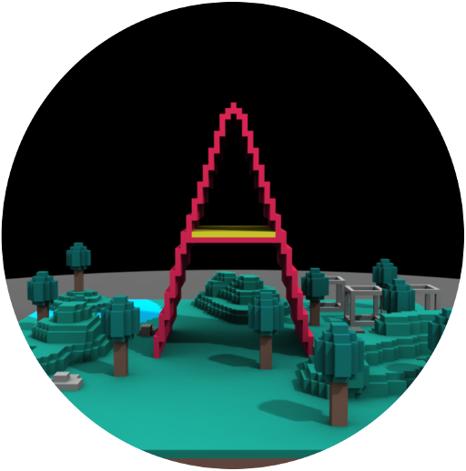

<!-- NOTES -->
- Can create scenes with MagicaVoxel
- Super easy tool, drop blocks like Minecraft
- Then export to A-Frame
- Everything in previous talk, works in A-Frame as well

---

## MagicaVoxel

<!-- .slide: data-transition="none" -->

<div class="stretch" data-aframe-scene="scenes/magicavoxel.html"></div>

<!-- NOTES -->
- MagicaVoxel model in A-Frame, mostly a line of HTML
- Show off the A-Frame Inspector by pressing `<ctrl> + <alt> + i`

---

## MagicaVoxel

<!-- .slide: data-transition="none" -->

<div class="stretch" data-aframe-scene="scenes/pokemon.html"></div>

<!-- NOTES -->
- Remember to manipulate and open inspector on second display

---

## tiny.cc/ningjs

<div class="stretch" data-aframe-scene="scenes/multiuser.html"></div>

<!-- NOTES -->
- QR code was genius

---

```html
<a-animation> <a-box> <a-camera> <a-circle> <a-collada-model>
<a-cone> <a-cursor> <a-curvedimage> <a-cylinder>
<a-dodecahedron> <a-isocahedron> <a-image> <a-light>
<a-obj-model> <a-plane> <a-ring> <a-tetrahedron> <a-torus>
<a-torus-knot> <a-sky> <a-sound> <a-sphere> <a-videosphere>
```

<!-- NOTES -->
- Handful elements that ship with A-Frame, but this is just the start
- Pretty easy to get a WebVR scene up and running
- Go back to the multiuser

---

<!-- .slide: data-background-video="media/video/aframe-examples.mp4" data-background-video-loop="true" data-state="state--bg-dark" -->

<!-- NOTES -->
- Add new elements, behavior, functionality? A-Frame built with extensibility at its core

------

# Entity-Component-System

<!-- .slide: data-background="media/img/minecraft-blocks.png" -->

<!-- NOTES -->
- Pattern popular in game development, used in game engines like Unity
- All objects in scene are **entities** that inherently empty objects. Plug in
  **components** to attach appearance / behavior / functionality
- Favors composition over inheritance
- Minecraft analogy: all blocks are entities, mix-and-match components to
  create different kinds of blocks (appearance, physics, behavior, sound, strength)
- Some more examples...

---

<!-- .slide: data-background="media/img/entity-component-system.png" data-background-size="contain" data-state="state--bg-white" -->

<!-- NOTES -->
- Additional analogies: smartphone, vehicle
- AFAIK A-Frame first tool to make ECS declarative

---

<!-- .slide: data-transition="slide-in none" -->

## Composing an Entity

```html
<a-entity>
```
<!-- .element: class="stretch" -->

<!-- NOTES -->
- Start with an `<a-entity>`
- By itself, has no appearance, behavior, functionality
- Plug in components to add appearance, behavior, functionality

---

## Composing an Entity

<!-- .slide: data-transition="none" -->

```html
<a-entity
  audio-visualizer="src: #rickroll-mp3; smoothingTimeConstant: 0.9">
```
<!-- .element: class="stretch" -->

<!-- NOTES -->
- Attach component via HTML attribute
- `audio-visualizer` component hooks up with Web Audio API's AnalyserNode, specify audio
- Component can consist of multiple properties
- Use syntax similar to CSS styles to configure components
- Analogy of CSS styling DOM elements, and components configuring entities

---

## Composing an Entity

<!-- .slide: data-transition="none" -->

```html
<a-entity
  audio-visualizer="src: #rickroll-mp3; smoothingTimeConstant: 0.9"
  audio-visualizer-scale="max: 50; multiplier: 0.06">
```
<!-- .element: class="stretch" -->

<!-- NOTES -->
- `audio-visualizer-scale` component scales children based on frequency data
- Using data set up by `audio-visualizer`
- Need to generate children

---

## Composing an Entity

<!-- .slide: data-transition="none" -->

```html
<a-entity
  audio-visualizer="src: #rickroll-mp3; smoothingTimeConstant: 0.9"
  audio-visualizer-scale="max: 50; multiplier: 0.06"
  entity-generator="mixin: bar; num: 256">
```
<!-- .element: class="stretch" -->

<!-- NOTES -->
- `entity-generator` component creates a number of entities, defined by mixins, as children
- Create 256 bars that will be scaled by `audio-visualizer-scale`

---

## Composing an Entity

<!-- .slide: data-transition="none" -->

```html
<a-entity
  audio-visualizer="src: #rickroll-mp3; smoothingTimeConstant: 0.9"
  audio-visualizer-scale="max: 50; multiplier: 0.06"
  entity-generator="mixin: bar; num: 256">


<a-mixin
  id="bar"
  geometry="primitive: box"
  material="color: black"
  color-via-scale-y="from: 10 60 10; to: 180 255 180; maxScale: 15">
```
<!-- .element: class="stretch" -->

<!-- NOTES -->
- Mixins are reusable groups of components, similar to CSS classes
- Create mixin for box that maps its color to its height
- `entity-generator` component creates 256 of these bars

---

## Composing an Entity

<!-- .slide: data-transition="none" -->

```html
<a-entity
  audio-visualizer="src: #rickroll-mp3; smoothingTimeConstant: 0.9"
  audio-visualizer-scale="max: 50; multiplier: 0.06"
  entity-generator="mixin: bar; num: 256"
  layout="type: circle; radius: 10">

<a-mixin
  id="bar"
  geometry="primitive: box"
  material="color: black"
  color-via-scale-y="from: 10 60 10; to: 180 255 180; maxScale: 15">
```
<!-- .element: class="stretch" -->

<!-- NOTES -->
- `layout` component to lay out all the bars in a circle, 10-meter radius

---

## Composing an Entity

<div class="stretch" data-aframe-scene="scenes/audio-visualizer.html"></div>

<!-- NOTES -->
- Have audio visualizer using that actual code, one line of HTML
- HTML elements before abtraction
- How to create components?

---

## Writing a Component

```js
AFRAME.registerComponent('my-component', {
  schema: {
    foo: {type: 'selector'},
    bar: {default: 256}
  },

  init: function () { // ... },
  update: function () { // ... },
  remove: function () { // ... },
  tick: function () { // ... }
});
```
<!-- .element: class="stretch" -->

```html
<a-box my-component="foo: #box; bar: 300""></a-box>
```

<!-- NOTES -->
- `schema`: defines how data is parsed from HTML
- Lifecycle methods:
  - `init`: component attached, like `componentDidMount`
  - `update`: component data update, like `componentWillReceiveProps`
  - `remove`: component detached, like `componentWillUnmount`
  - `tick`: run on every frame
- Properties:
  - `el`: reference to entity element
  - `data`: component data parsed from HTML
  - `object3D`: three.js object

---

<!-- .slide: data-background="media/img/standard-components.png" data-background-size="contain" -->

<!-- NOTES -->
- Components that ship with A-Frame
- Bare bones, allow ecosystem to enable features

---

<!-- .slide: data-background="media/img/community-components.png" data-background-size="contain" -->

<!-- NOTES -->
- Components built by the community and ecosystem
- Developers enabling others
- Components can be consumed without programming knowledge

------

# Community

<div class="captioned-image-row">
  <div>
    
    <i>60 contributors, 3000 Stargazers</i>
  </div>
  <div>
    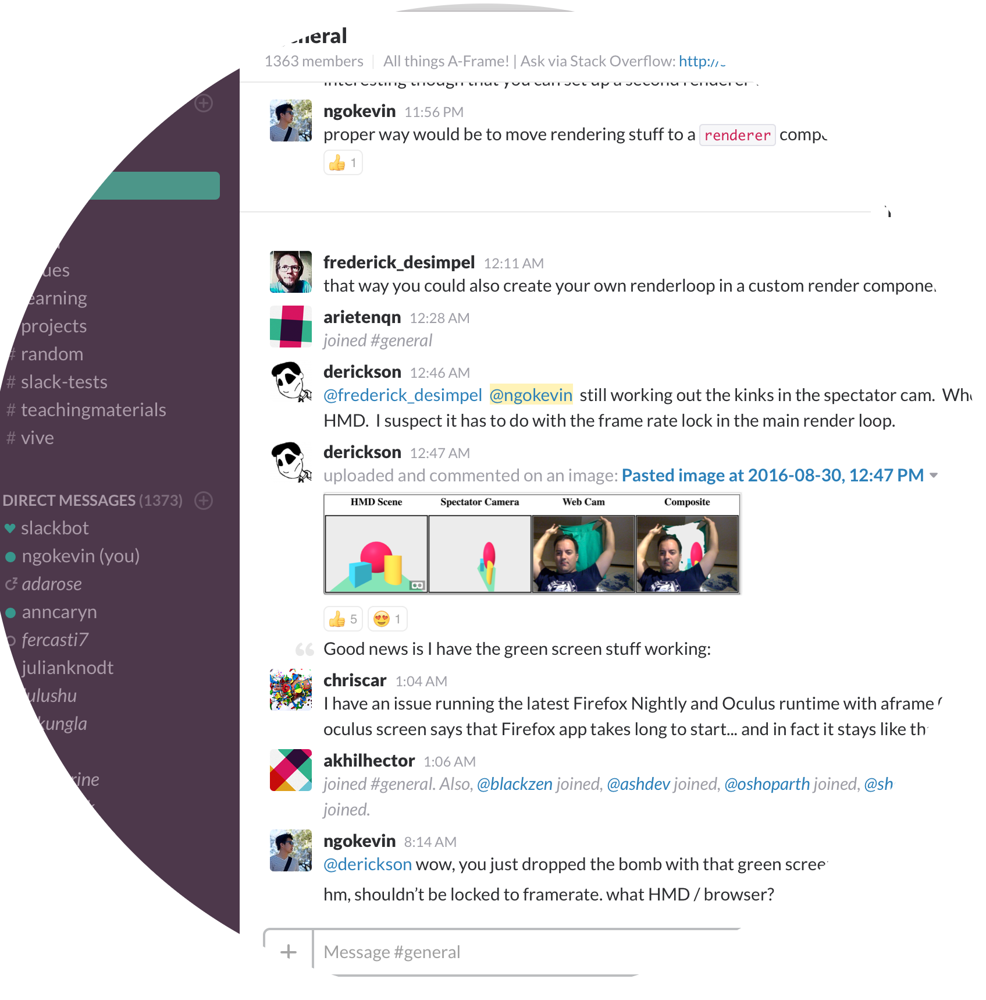
    <i>1400 members on Slack</i>
  </div>
  <div>
    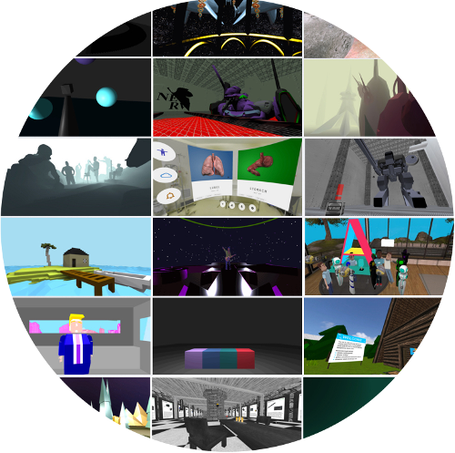
    <i>100s of featured projects</i>
  </div>
</div>

<!-- NOTES -->
- Open source and inclusive project
- Most work done on GitHub
- Active community on Slack to share projects, interact, hang out, seek help
- Featured projects on the `awesome-aframe` repository and *A Week of A-Frame* blog

---

<!-- .slide: data-background="media/img/360syria.jpg" -->

## Fear of the Sky

Amnesty International UK

[360syria.com](http://360syria.com)

<!-- NOTES -->
- Journalism, e-commerce, and real estate popular production use cases

---

## Stand at the Edge of Geologic Time

<!-- .slide: data-background="media/img/npr.png" -->

National Public Radio (NPR)

[apps.npr.org/rockymountain-vr](http://apps.npr.org/rockymountain-vr/)

---

<!-- .slide: data-background="media/img/mars.jpg" -->

## Journey to Mars

The Washington Post

[washingtonpost.com/video/mars/public/](https://www.washingtonpost.com/video/mars/public/)

---

<!-- .slide: data-background-video="media/video/livetour.mp4" data-background-video-loop="true" -->

## LiveTour

iStaging

[vrviewer.istaging.co/#!/684173](http://vrviewer.istaging.co/#!/684173)

<!-- NOTES -->
- Virtual real estate and apartment tours

---

# Augmented Reality

<video class="stretch" data-src="media/video/argon.mp4" data-autoplay loop></video>

<!-- NOTES -->
- Not just a framework for VR, can also handle 3D and AR as well
- Prototype by Blair MacIntyre from Georgia Tech with Argon Browser
- Most predict AR to be even bigger market than VR

------

<!-- .slide: class="slide__questions" data-background="media/img/scene-collage.jpg" style="background-color: rgba(30, 30, 30, 0.3)" -->

# Help Invent the Future  <!-- .element: style="color: #FFF" -->

- Try it out [aframe.io](https://aframe.io)
- See what people have made [aframe.io/blog](https://aframe.io/blog)
- Join us on Slack [aframevr-slack.herokuapp.com](https://aframevr-slack.herokuapp.com/)
- Follow us [@aframevr](https://twitter.com/aframevr)
- Contribute on [github.com/aframevr/aframe](https://github.com/aframevr/aframe)

<!-- NOTES -->
- Homepage which has examples, documentation, blog
- Slack extremely active, core team responsive, over 1300 people
- Keep up to date by following on Twitter
