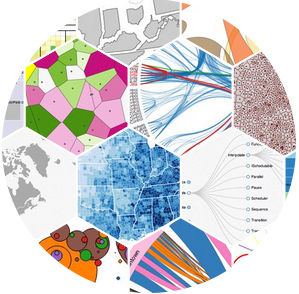
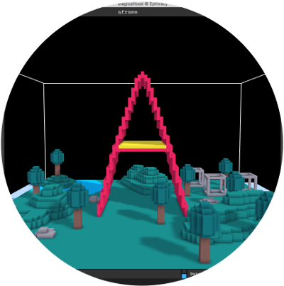
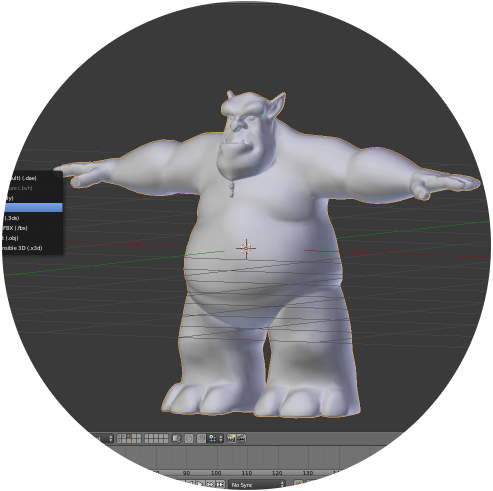
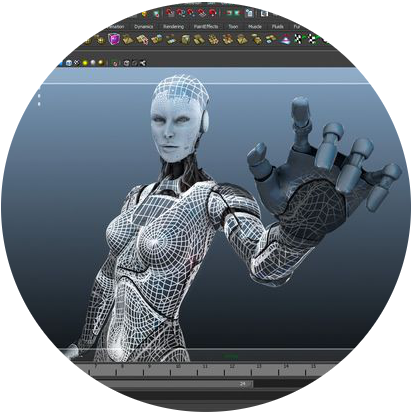

o!-- .slide: class="slide__title" data-background-video="media/video/aframe-logo.mp4" data-background-video-loop="true" -->

<div class="talk-title">
  <h1>A-Frame</h1>
  <h2>Building VR on the Web</h2>
</div>

@you / 01 January 2016 / San Francisco, CA aframe.io <!-- .element: class="talk-info" -->

------

# Virtual Reality  <!-- .element: data-autoslide="0" class="fragment fade-out" -->

<!-- .slide: data-autoslide="5000" data-background-video="media/video/virtualreality.mp4" data-background-video-loop="true" data-background-video-muted="true" -->

<!-- NOTES -->
- Technology that simulates physical presence in interactive and realistic 3D
  environments
- Next platform. From PCs -> Smartphones -> VR
- Change how we work + play + communicate digitally
- Digi-Capital forecasts $20B VR market by 2020, half Asia
- Tell your stories about VR (e.g., I hit someone on the head while playing Fruit Ninja)

---

## Hardware

<div class="image-row">
  <div></div>
  <div></div>
  <div></div>
</div>

<div class="image-row">
  <div></div>
  <div></div>
  <div></div>
</div>

<!-- NOTES -->
- Free to $899
- Tethered and untethered
- Smartphone, gaming consoles, and PCs
- Positional tracking vs. rotational only
- Controllers (3DoF vs. fully tracked) vs. headset only
- Inside-out vs. outside-in tracking systems
- **HTC Vive** currently the most compelling

---

## Friction of VR Ecosystems

<div class="captioned-image-row">
  <div>
    
    <i>Gatekeepers</i>
  </div>
  <div>
    
    <i>Installs</i>
  </div>
  <div>
    
    <i>Closed</i>
  </div>
</div>

<!-- NOTES -->
- App stores control approval/distribution, can take down content, single points of failure
- Users have to go through downloads/installs
- Proprietary tech (Unity/Unreal), steep learning curve, fragmentation,
  cross-compat issues, siloed experiences

------

# WebVR

An open virtual reality platform with the advantages of **the Web**

<div class="captioned-image-row">
  <div>
    
    <i>Open</i>
  </div>
  <div>
    
    <i>Connected</i>
  </div>
  <div>
    
    <i>Instant</i>
  </div>
</div>

<!-- NOTES -->
- Anyone can publish, open source, open standards
- Traverse from world to world, not siloed experiences
- Click a link, immediately get into an experience, easily sharable via links,
  great for long tail bite-sized experiences
- Can't wait for the platform to bake and crystallize for years before Web gets involved

---


Standard browser APIs that enable WebGL rendering to headsets and access to VR
sensors
https://w3c.github.io/webvr/

<!-- NOTES -->
- Working W3C community group
- Initial WebVR API by Mozilla (Vlad V.)
- Mozilla, Google, Samsung, Microsoft, community currently drafting WebVR 1.0 API
- Optimized rendering path to headsets, 90fps+
- Access position and rotation (pose) data

---

<div class="captioned-image-row">
  <div>
    
    <i>Firefox Nightly</i>
  </div>
  <div>
    
    <i>Chromium (Experimental)</i>
  </div>
  <div>
    
    <i>Samsung Internet</i>
  </div>
  <div>
    
    <i>Mobile Polyfill</i>
  </div>
</div>

<!-- NOTES -->
- Browser support
- Firefox + Chrome WebVR 1.0 hits release channels by early 2017
- Firefox Nightly: first WebVR browser
- Chromium: custom Chromium builds by Brandon Jones
- Samsung: GearVR browser, with a flag
- Mobile Polyfill: use device motion/orientation sensors to polyfill on smartphones

---

<!-- .slide: data-background-video="media/video/roomscale.mp4" -->

## The Web is Ready for VR

<!-- NOTES -->
- The Web is capable of VR
- Walk in a web page, reach out with your hands

---

## Metaverse

<!-- .slide: data-background="media/img/metaverse.png" -->

---

<!-- .slide: data-background-video="media/video/boilerplate.mp4" -->

<div class="slide__boilerplate">
  <p>Import WebVR polyfill</p>
  <p>Set up camera</p>
  <p>Set up lights</p>
  <p>Initialize scene</p>
  <p>Declare and pass canvas</p>
  <p>Listen to window resize</p>
  <p>Install VREffect</p>
  <p>Instantiate renderer</p>
  <p>Create render loop</p>
  <p>Preload assets</p>
  <p>Figure out responsiveness</p>
  <p>Deal with metatags and mobile</p>
</div>

<!-- NOTES -->
- Too difficult to create WebVR experiences
- Obstacle if doing small prototypes and experiments
- Boilerplate needs updating with new versions of WebVR, three.js, and
  handle cross-browser and cross-platform compatibility

---

<!-- .slide: data-transition="concave" -->

```html
<a-scene></a-scene>
```

<!-- NOTES -->
- "What if we could encapsulate all that boilerplate to just one line of HTML?"
- Quickly go from idea to prototype without hassle

---

```js
// Box in three.js
var geometry = new THREE.BoxGeometry(1, 2, 3);
var material = new THREE.MeshStandardMaterial({color: 'red'});
var box = new THREE.Mesh(geometry, material);
box.position.set(10, 0, 10);
scene.add(box);
```

<!-- NOTES -->
- Creating the simplest object in vanilla three.js
- Takes five lines and three variables

---

<!-- .slide: data-transition="concave" -->

```html
<a-box color="red" position="10 0 10"></a-box>
```

<!-- NOTES -->
- "What if we could encapsulate objects into a single lines of HTML?"
- Quickly build scenes without worry

------

# A-Frame

<!-- .slide: data-background="media/img/aframe-rendered-full.png" -->

A declarative framework for building virtual reality experiences on the Web

<!-- NOTES -->
- A-Frame launched December 2015 by the Mozilla VR team
- Make it easy for anyone to create VR content
- Further democratize the dark arts of graphics
- Enable web developers
- Prototype and experiment faster
- A vehicle to kickstart WebVR ecosystem

---

## Hello World

<!-- .slide: data-transition="slide-in none" -->

```html
<a-scene>
  <a-box color="#4CC3D9" position="-1 0.5 -3" rotation="0 45 0"></a-box>
  <a-cylinder color="#FFC65D" position="1 0.75 -3" radius="0.5" height="1.5"></a-cylinder>
  <a-sphere color="#EF2D5E" position="0 1.25 -5" radius="1.25"></a-sphere>
  <a-plane color="#7BC8A4" position="0 0 -4" rotation="-90 0 0" width="4" height="4"></a-plane>
  <a-sky color="#ECECEC"></a-sky>
</a-scene>
```
<!-- .element: class="stretch" -->

<!-- NOTES -->
- Parsable: HTML arguably most accessible language in computing
- Declarative: visual representation of scene graph, fully represents state
- Encapsulated: copy-and-paste HTML anywhere else and still work, no variables

---

## Hello World

<!-- .slide: data-transition="none" -->

<div class="stretch" data-aframe-scene="scenes/hello-world.html"></div>

<!-- NOTES -->
- Supports desktop, Android, iOS, Samsung Gear VR, Oculus Rift, HTC Vive
- As web technology, we can embed within slides
- And view source in DOM inspector and change values live
- Can go fullscreen, would go into VR if a headset was connected
- Can view on mobile if people go to aframe.io

------

# Entity-Component-System

<!-- .slide: data-background="media/img/minecraft-blocks.png" -->

<!-- NOTES -->
- Pattern popular in game development, used in game engines like Unity
- All objects in scene are **entities** that inherently do nothing. Plug in
  **components** to attach appearance / behavior / functionality
- Favors composition over inheritance
- Minecraft analogy: all blocks are entities, mix-and-match components to
  create different kinds of blocks (appearance, physic, behavior, sound, strength)

---

<!-- .slide: data-background="media/img/entity-component-system.png" data-background-size="contain" -->

<!-- NOTES -->
- Additional analogies: smartphone, vehicle

---

<!-- .slide: data-transition="slide-in none" -->

## Composing an Entity

```html
<a-entity>
```
<!-- .element: class="stretch" -->

<!-- NOTES -->
- A-Frame invented declarative form of entity-component-system using HTML
- Start with an `<a-entity>`
- By itself, has no appearance, behavior, functionality
- Plug in components to add appearance, behavior, functionality

---

## Composing an Entity

<!-- .slide: data-transition="none" -->

```html
<a-entity
  audio-visualizer="src: #rickroll-mp3; smoothingTimeConstant: 0.9">
```
<!-- .element: class="stretch" -->

<!-- NOTES -->
- Attach component via HTML attribute
- `audio-visualizer` component hooks up with Web Audio API's AnalyserNode, specify audio
- Component can consist of multiple properties
- Use syntax similar to CSS styles to configure components
- Analogy of CSS styling DOM elements, and components configuring entities

---

## Composing an Entity

<!-- .slide: data-transition="none" -->

```html
<a-entity
  audio-visualizer="src: #rickroll-mp3; smoothingTimeConstant: 0.9"
  audio-visualizer-scale="max: 50; multiplier: 0.06">
```
<!-- .element: class="stretch" -->

<!-- NOTES -->
- `audio-visualizer-scale` component scales children based on frequency data
- Using data set up by `audio-visualizer`
- Need to generate children

---

## Composing an Entity

<!-- .slide: data-transition="none" -->

```html
<a-entity
  audio-visualizer="src: #rickroll-mp3; smoothingTimeConstant: 0.9"
  audio-visualizer-scale="max: 50; multiplier: 0.06"
  entity-generator="mixin: bar; num: 256">
```
<!-- .element: class="stretch" -->

<!-- NOTES -->
- `entity-generator` component creates a number of entities, defined by mixins, as children
- Create 256 bars that will be scaled by `audio-visualizer-scale`

---

## Composing an Entity

<!-- .slide: data-transition="none" -->

```html
<a-entity
  audio-visualizer="src: #rickroll-mp3; smoothingTimeConstant: 0.9"
  audio-visualizer-scale="max: 50; multiplier: 0.06"
  entity-generator="mixin: bar; num: 256">


<a-mixin
  id="bar"
  geometry="primitive: box"
  material="color: black"
  color-via-scale-y="from: 10 60 10; to: 180 255 180; maxScale: 15">
```
<!-- .element: class="stretch" -->

<!-- NOTES -->
- Mixins are reusable groups of components, similar to CSS classes
- Create mixin for box that maps its color to its height
- `entity-generator` component creates 256 of these bars

---

## Composing an Entity

<!-- .slide: data-transition="none" -->

```html
<a-entity
  audio-visualizer="src: #rickroll-mp3; smoothingTimeConstant: 0.9"
  audio-visualizer-scale="max: 50; multiplier: 0.06"
  entity-generator="mixin: bar; num: 256"
  layout="type: circle; radius: 10">

<a-mixin
  id="bar"
  geometry="primitive: box"
  material="color: black"
  color-via-scale-y="from: 10 60 10; to: 180 255 180; maxScale: 15">
```
<!-- .element: class="stretch" -->

<!-- NOTES -->
- `layout` component to lay out all the bars in a circle, 10-meter radius

---

## Baking an Entity

```html
<a-entity
  audio-visualizer="src: #rickroll-mp3; smoothingTimeConstant: 0.9"
  audio-visualizer-scale="max: 50; multiplier: 0.06"
  entity-generator="mixin: bar; num: 256"
  layout="type: circle; radius: 10">
```
<!-- .element: class="stretch" -->

```html
<a-udio-spectrum-visualizer src="#rickroll-mp3" num-bars="256" radius="10">
```

<!-- NOTES -->
- Use `AFRAME.registerPrimitive` to create prefabs or templates of pre-composed
  configuration of components
- Define default components and component properties
- Create mappings between component properties and HTML attributes

---

## Basic Component

```js
AFRAME.registerComponent('position', {
  schema: {type: 'vec3'},

  update: function () {
    var el = this.el;
    var data = this.data;
    var object3D = el.object3D;

    object3D.position.set(data.x, data.y, data.z);
  }
});
```
<!-- .element: class="stretch" -->

```html
<a-box position="-1 1 1"></a-box>
```

<!-- NOTES -->
- `schema`: defines how data is parsed from HTML
- Lifecycle methods:
  - `init`: component attached, like `componentDidMount`
  - `update`: component data update, like `componentWillReceiveProps`
  - `remove`: component detached, like `componentWillUnmount`
  - `tick`: run on every frame
- Properties:
  - `el`: reference to entity element
  - `data`: component data parsed from HTML
  - `object3D`: three.js object

---

## Writing a Component

```js
AFRAME.registerComponent('crazy-position', {
  schema: {
    min: {type: 'vec3'},
    max: {type: 'vec3'}
  },

  tick: function () {
    var data = this.data;
    var randomPosition = __getRandomPosition(min, max);
    this.el.object3D.position.copy(randomPosition);
  }
});
```
<!-- .element: class="stretch" -->

```html
<a-sphere crazy-position="min: -1 -1 -1; max: 1 1 1"></a-sphere>
```

<!-- NOTES -->
- Component that sets random position on each tick
- Can be reused and composed with other components for variety of situations
- Can be shared to other developers
- Grants 100% extensibility, maintain access to JS / three.js / WebGL

------

# Integration

```js
const scene = document.querySelector('a-scene');

const sphere = document.createElement('a-sphere');

sphere.setAttribute('radius', 2);

sphere.addEventListener('click', function () {
  this.setAttribute('color', 'red');
});

scene.appendChild(sphere);
```
<!-- .element: class="stretch" -->

<!-- NOTES -->
- Integrates with web languages and APIs
- Fully controllable through JavaScript and DOM APIs

---

<div class="captioned-image-row">
  <div>
    
    <i>d3.js</i>
  </div>
  <div>
    
    <i>vue.js</i>
  </div>
  <div>
    
    <i>React & Redux</i>
  </div>
</div>

<!-- NOTES -->
- Based on DOM
- Can integrate with existing libraries and web frameworks

---

<div class="captioned-image-row">
  <div>
    
    <i>MagicaVoxel</i>
  </div>
  <div>
    
    <i>Blender</i>
  </div>
  <div>
    
    <i>Maya</i>
  </div>
</div>

<!-- NOTES -->
- Can be used alongside 3D tools
- Create models and scenes to place into A-Frame

---

## With MagicaVoxel


<!-- NOTES -->
- Can create scenes with MagicaVoxel
- Super easy tool, drop blocks like Minecraft
- Then export to A-Frame

---

## With MagicaVoxel

<div class="stretch" data-aframe-scene="scenes/magicavoxel.html"></div>

<!-- NOTES -->
- MagicaVoxel model in A-Frame, mostly a line of HTML
- Show off the A-Frame Inspector by pressing `<ctrl> + <alt> + i`

------

# Ecosystem

<div class="captioned-image-row">
  <div>
    
    <i>60 contributors, 3000 Stargazers</i>
  </div>
  <div>
    
    <i>1400 members on Slack</i>
  </div>
  <div>
    
    <i>100s of featured projects</i>
  </div>
</div>

<!-- NOTES -->
- Open source and inclusive project
- Most work done on GitHub
- Active community on Slack to share projects, interact, hang out, seek help
- Featured projects on the `awesome-aframe` repository and *A Week of A-Frame* blog

---

<!-- .slide: data-background="media/img/standard-components.png" data-background-size="contain" -->

<!-- NOTES -->
- Components that ship with A-Frame
- Bare bones, allow ecosystem to enable features

---

<!-- .slide: data-background="media/img/community-components.png" data-background-size="contain" -->

<!-- NOTES -->
- Components built by the community and ecosystem
- Developers enabling others
- Components can be consumed without programming knowledge

---

<!-- .slide: data-background="media/img/360syria.jpg" -->

## Fear of the Sky

Amnesty International UK

[360syria.com](https://360syria.com)

<!-- NOTES -->
- Journalism, e-commerce, and real estate popular production use cases

---

## Stand at the Edge of Geologic Time

<!-- .slide: data-background="media/img/npr.png" -->

National Public Radio (NPR)

[apps.npr.org/rockymountain-vr](http://apps.npr.org/rockymountain-vr/)

---

<!-- .slide: data-background="media/img/mars.jpg" -->

## Journey to Mars

The Washington Post

[washingtonpost.com/video/mars/public/](https://www.washingtonpost.com/video/mars/public/)

---

<!-- .slide: data-background-video="media/video/livetour.mp4" data-background-video-loop="true" -->

## LiveTour

iStaging

[vrviewer.istaging.co/#!/684173](http://vrviewer.istaging.co/#!/684173)

<!-- NOTES -->
- Virtual real estate and apartment tours

---

# Augmented Reality

<video class="stretch" data-src="media/video/argon.mp4" data-autoplay loop></video>

<!-- NOTES -->
- Not just a framework for VR, can also handle 3D and AR as well
- Prototype by Blair MacIntyre from Georgia Tech with Argon Browser
- Most predict AR to be even bigger market than VR

------

<!-- .slide: class="slide__questions" data-background="media/img/scene-collage.jpg" style="background-color: rgba(30, 30, 30, 0.3)" -->

# Questions?  <!-- .element: style="color: #FFF" -->

- Try it out [aframe.io](https://aframe.io)
- Join us on Slack [aframevr-slack.herokuapp.com](https://aframevr-slack.herokuapp.com/)
- Follow us [@aframevr](https://twitter.com/aframevr)

<!-- NOTES -->
- Homepage which has examples, documentation, blog
- Slack extremely active, core team responsive, over 1300 people
- Keep up to date by following on Twitter
