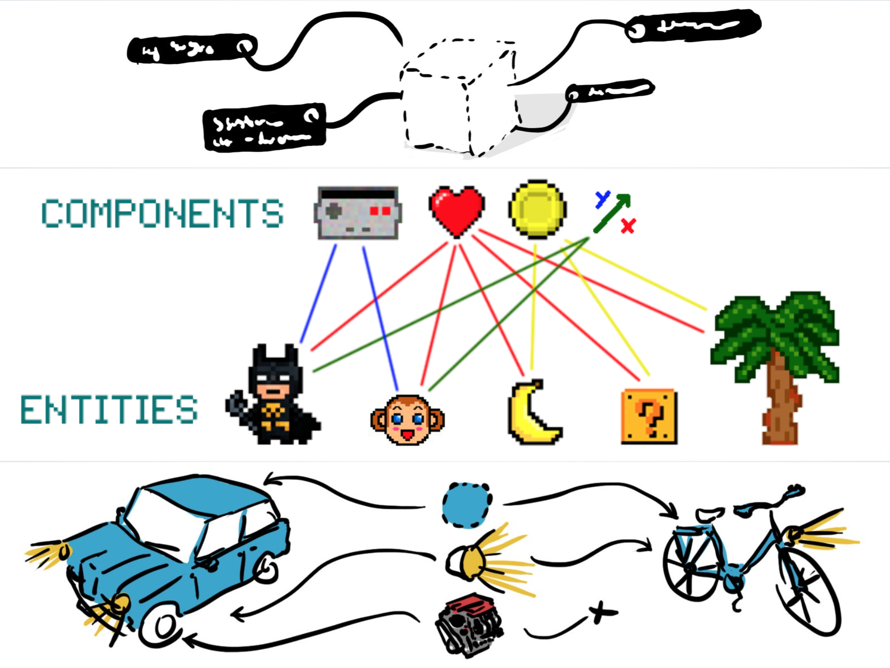

# A-Frame

## Building Blocks for the VR Web

@you / 01 January 2016 / San Francisco, CA

------

# Virtual Reality (VR)

Technology that simulates physical presence in interactive and realistic 3D
environments

<!--Notes
- Next platform. From PCs -> Smartphones -> VR
- Change how we work + play + communicate digitally
- AR/VR advisor Digi-Capital forecasts $120B market by 2020, half Asia
-->

---

## Hardware

<div class="image-row">
  <div></div>
  <div></div>
  <div></div>
</div>

<div class="image-row">
  <div></div>
  <div></div>
  <div></div>
</div>

<!--Notes
- **Cardboard**: free, plain smartphones in holders, low-fidelity, rotational tracking only
- **Daydream**: VR-ready Android smartphones, includes 3DoF controller, rotational only
- **GearVR**: untethered; decent quality experiences; many already own Samsung phones
- **Rift**: $599, Oculus + Facebook, waiting for Touch controllers (~$200), rotational + positional but not complete room scale, outside-in tracking system
- **Playstation**: $400, many already own console, out in Fall 2016
- **Vive**: Steam VR, most compelling platform with room scale + tracked controllers + inside-out tracking system
-->

---

## Friction

- App stores and gatekeepers
- Downloads and installs
- Proprietary and closed culture

<!--Notes
- App stores and gatekeepers control approval and distribution
- Users have to go through downloads and installs
- Proprietary technology (Unity, Unreal)
- Steep learning curve, not friendly for beginners or non-tech people
-->

------

# WebVR

An open virtual reality platform with the advantages of the Web

<div class="captioned-image-row">
  <div>
    
    <i>Open</i>
  </div>
  <div>
    
    <i>Connected</i>
  </div>
  <div>
    
    <i>Instant</i>
  </div>
</div>

<!--Notes
- Open: anyone can publish, open source tech, standards
- Connected: traverse/link from world to world, not siloed experiences
- Instant: click a link and immediately get into an experience, easily sharable via links
-->

---


Set of **standard browser APIs** that enable **WebGL rendering to headsets**
and **access to various VR sensors** for pose and input.
https://w3c.github.io/webvr/

<!--Notes
-->

---

## Applications

- Long tail experiences
- E-commerce
- Social media

<!--Notes
-->

---

## Browser Support

<div class="captioned-image-row">
  <div>
    
    <i>Firefox Nightly</i>
  </div>
  <div>
    
    <i>Chromium (Experimental)</i>
  </div>
  <div>
    
    <i>Samsung Internet</i>
  </div>
  <div>
    
    <i>Mobile Polyfill</i>
  </div>
</div>

<!--Notes
-->

------

# A-Frame

A web framework for building virtual reality experiences with HTML

```html
<a-scene>
  <a-box color="#4CC3D9" position="-1 0.5 -3" rotation="0 45 0"></a-box>
  <a-cylinder color="#FFC65D" position="1 0.75 -3" radius="0.5" height="1.5"></a-cylinder>
  <a-sphere color="#EF2D5E" position="0 1.25 -5" radius="1.25"></a-sphere>
  <a-plane color="#7BC8A4" rotation="-90 0 0" position="0 0 -4" width="4" height="4"></a-plane>
  <a-sky color="#ECECEC"></a-sky>
</a-scene>
```

<!--Notes
-->

---

## Hello World

<div class="aframe-scene">
  <a-scene embedded>
    <a-box color="#4CC3D9" position="-1 0.5 -3" rotation="0 45 0"></a-box>
    <a-cylinder color="#FFC65D" position="1 0.75 -3" radius="0.5" height="1.5"></a-cylinder>
    <a-sphere color="#EF2D5E" position="0 1.25 -5" radius="1.25"></a-sphere>
    <a-plane color="#7BC8A4" rotation="-90 0 0" position="0 0 -4" width="4" height="4"></a-plane>
    <a-sky color="#ECECEC"></a-sky>
  </a-scene>
</div>

<!--Notes
-->

---

## Hardware

Works across desktop, iOS, Android, Oculus Rift, HTC Vive

<!--Notes
-->

---

<!-- .slide: data-background-video="media/video/link-traversal.mp4" -->

<!--Notes
-->

---

<!-- .slide: data-background-video="media/video/roomscale.mp4" -->

<!--Notes
-->

---

<!-- .slide: data-background-video="media/video/local-multiplayer.mp4" -->

<!--Notes
-->

------

# Why A-Frame?

- **Simple** &mdash; zero boilerplate
- **Easy** &mdash; use with languages and tools we know
- **Powerful** &mdash; declarative entity-component-system

<!--Notes
-->

------

## Boilerplate without A-Frame

<!-- .slide: data-background-video="media/video/boilerplate.mp4" data-state="background-low-opacity" data-transition="concave" data-background-transition="none" -->

<div class="slide__boilerplate">
  <p>Import WebVR polyfill</p>
  <p>Set up camera</p>
  <p>Set up lights</p>
  <p>Initialize scene</p>
  <p>Declare and pass canvas</p>
  <p>Listen to window resize</p>
  <p>Install VREffect</p>
  <p>Instantiate renderer</p>
  <p>Create render loop</p>
  <p>Preload assets</p>
  <p>Figure out responsiveness</p>
  <p>Deal with metatags and mobile</p>
</div>

<!--Notes
-->

---

<!-- .slide: data-transition="concave" -->

```html
<a-scene></a-scene>
```

<!--Notes
-->

---

## The Simplest Things Made Simpler

<!-- .slide: data-transition="concave" -->

```js
// Box in three.js
var geometry = new THREE.BoxGeometry(1, 2, 3);
var material = new THREE.MeshStandardMaterial({color: 'red'});
var box = new THREE.Mesh(geometry, material);
box.position.set(10, 0, 10);
scene.add(box);
```

<!--Notes
-->

---

<!-- .slide: data-transition="concave" -->

```html
<a-box color="red" position="10 0 10"></a-box>
```

<!--Notes
-->

------

## Languages & Tools We Know

- HTML
- JavaScript and DOM APIs
- Integrates with existing frameworks and libraries

```js
var scene = document.querySelector('a-scene');
var sphere = document.createElement('a-sphere');
sphere.setAttribute('radius', 2);
scene.appendChild(sphere);
```

<!--Notes
-->

---

## Languages & Tools We Know

<div class="captioned-image-row">
  <div>
    
    <i>d3.js</i>
  </div>
  <div>
    
    <i>vue.js</i>
  </div>
  <div>
    
    <i>React & Redux</i>
  </div>
</div>

<!--Notes
-->

---

## Languages & Tools We Know

<div class="captioned-image-row">
  <div>
    
    <i>MagicaVoxel</i>
  </div>
  <div>
    
    <i>Blender</i>
  </div>
  <div>
    
    <i>Maya</i>
  </div>
</div>

<!--Notes
-->

------

# Entity-Component-System



- Composable, reusable, sharable bits of code
- All the power of JavaScript, three.js, and WebGL
- Developers empower other developers

<!--Notes
-->

---

<!-- .slide: data-transition="slide-in none" -->

## Composing an Entity

```html
<a-entity></a-entity>
```

<!--Notes
-->

---

<!-- .slide: data-transition="none" -->

## Composing an Entity

```html
<a-entity geometry="primitive: plane; height: 10000; width: 10000">
```

<!--Notes
-->

---

<!-- .slide: data-transition="none" -->

## Composing an Entity

```html
<a-entity geometry="primitive: plane; height: 10000; width: 10000"
          rotation="-90 0 0">
```

<!--Notes
-->

---

<!-- .slide: data-transition="none" -->

## Composing an Entity

```html
<a-entity geometry="primitive: plane; height: 10000; width: 10000"
          rotation="-90 0 0"
          material="shader: standard; opacity: 0.8">
```

<!--Notes
-->

---

## Composing an Entity

<!-- .slide: data-transition="none" -->

```html
<a-entity geometry="primitive: plane; height: 10000; width: 10000"
          rotation="-90 0 0"
          material="shader: standard; normalTextureRepeat: 50 50; opacity: 0.8"
          ocean-waves="intensity: 0.7">
```

<!--Notes
-->

---

## Baking an Entity

```js
AFRAME.registerPrimitive('a-ocean', {
  defaultComponents: {
    'ocean-waves': {intensity: 0.7}
  },

  mappings: {
    'reflection': 'material.sphericalEnvMap',
    'wave-intensity': 'ocean-waves.intensity'
  }
});
```

```html
<a-ocean reflection="url(sky.png)" wave-intensity="2"></a-ocean>
```

<!--Notes
-->

---

## Structure of a Component

```js
AFRAME.registerComponent('position', {
  schema: {type: 'vec3'},

  update: function () {
    var el = this.el;  // Reference to the entity element.
    var data = this.data;  // Component data parsed from HTML.
    var object3D = el.object3D;  // three.js Object.

    object3D.position.set(data.x, data.y, data.z);
  }
});
```

<!--Notes
-->

---

## Writing a Component

```js
AFRAME.registerComponent('crazy-position', {
  schema: {
    min: {type: 'vec3'},
    max: {type: 'vec3'}
  },

  tick: function () {
    var data = this.data;
    var randomPosition = __getRandomPosition(min, max);
    this.el.object3D.position.copy(randomPosition);
  }
});
```

```html
<a-sphere crazy-position="min: -1 -1 -1; max: 1 1 1"></a-sphere>
```

<!--Notes
-->

------

# Community

- **Github**: 60 contributors, 2800 stargazers
- **Slack**: 1300 members
- **Content**: Hundreds of projects featured on `awesome-aframe` repository and *A Week of A-Frame*

<!--Notes
-->

---

<!-- .slide: data-background="media/img/standard-components.png" data-background-size="contain" -->

<!--Notes
-->

---

<!-- .slide: data-background="media/img/community-components.png" data-background-size="contain" -->

<!--Notes
-->

---

## Scenes by Organizations

- [360syria.com](https://360syria.com) (Amnesty International UK)
- [apps.npr.org/rockymountain-vr](http://apps.npr.org/rockymountain-vr/)
- [gurivr.com](https://gurivr.com/) (The Coral Project)
- [washingtonpost.com/graphics/business/mars-journey](https://www.washingtonpost.com/graphics/business/mars-journey/)
- [shopifyvr.myshopify.com](https://shopifyvr.myshopify.com/)

<!--Notes
-->

------

# Augmented Reality

<video class="stretch" data-src="media/video/argon.mp4" data-autoplay loop></video>

<!--Notes
-->

------

<!-- .slide: data-background="media/img/scene-collage.jpg" data-state="background-low-opacity" style="background-color: rgba(239, 45, 94, 0.9); color: #EEE" -->

# Questions?  <!-- .element: style="color: #FFF" -->

- Try it out [aframe.io](https://aframe.io)
- Join us on Slack [aframevr-slack.herokuapp.com](https://aframevr-slack.herokuapp.com/)
- Follow us [@aframevr](https://twitter.com/aframevr)

<!--Notes
-->
